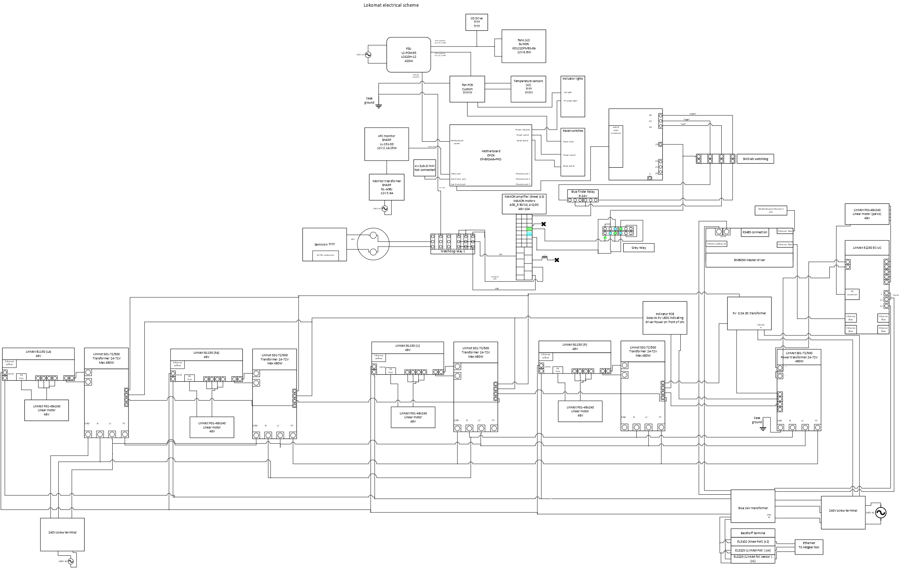
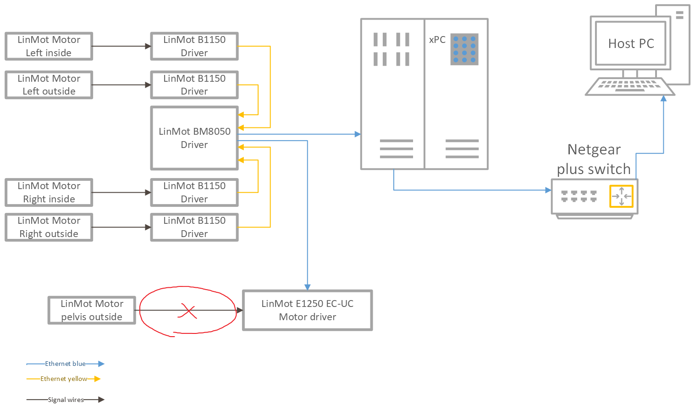
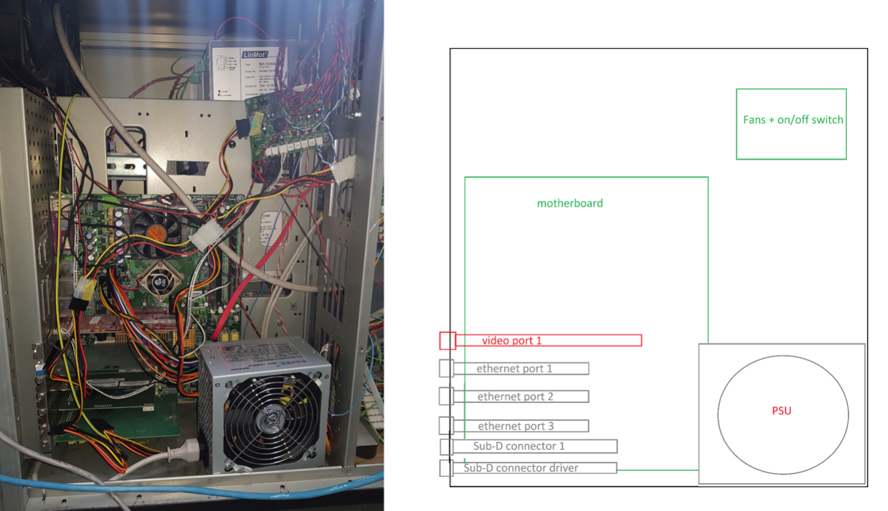
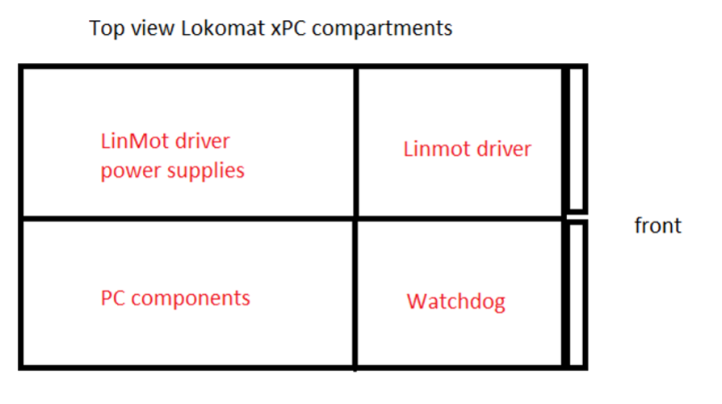

# LokomatManuals  
The manuals for all components of the Lokomat system. This does not include the original parts of the Lokomat (with FreeD module). Available documentation for Lokomat below:  
- [Lokomat Technical Datasheet](Other/Lokomat_Technical_Datasheet.pdf)
- [Lokomat Brochure](Other/Lokomat_Brochure.pdf)
- [Lokomat FreeD Brochure](Other/Lokomat_FreeD_Brochure.pdf)

> Note: **?** Questionmarks indicate unclear parts which need to be looked into further.

## Overall structure
- **Thigh**: Thigh actuators (LinMot motors) for flexion/adduction 
    - 4x [P01-48x240's](Manuals/LinMot_P01-48x240.pdf) (motors)
        > Note: These have built-in position encoders   
        - 1x [B8050](Manuals/LinMot_B1150_B8050.pdf) (master driver)
            > B1150 drives together with the bus modules B8050 are designed for cost optimized, modular multi axes systems with the industrial Ethernet interfaces EtherCAT, Profinet, EthernetIP, Sercos III and Powerlink.  
        - 4x [B1150](Manuals/LinMot_B1150_B8050.pdf) (drivers)  
        - 4x [HS01-48x250](LinMot_HS01-48x250.pdf) (guides)  
        - 4x [S01-72/500](Manuals/LinMot_S01-72_500.pdf) (transformers)  
        - 4x [WPS-1250-MK46-P10](Manuals/MICRO_EPSILON_WPS-1250-MK46-P10.pdf) (potentiometers for position)
            - 4x [EL3255](Manuals/Backhoff_el3255en.pdf) (input terminals for potentiometers)
- **Pelvis**: there's a plate with passive compliance (spring) in 5 DOF and actuated in 1 DOF. It's position+velocity are measured using external sensors.
    > Note: This motor is currently not working
    - 1x [P01-48x240's](Manuals/LinMot_P01-48x240.pdf) (motor)  
        > Note: These have built-in position encoders
        - 1x [EC1250-EC-UC](Manuals/LinMot_EC1250-EC-UC) (driver)
        - 1x [HS01-48x250](LinMot_HS01-48x250.pdf) (guide)  
        - 1x [S01-72/500](Manuals/LinMot_S01-72_500.pdf) (transformer)  
        - **?** [Sensofoil potentiometer (exact model unknown)](Manuals/Hoffman_Krippner_2020_Sensofoil_Produktinfo.pdf)  
            - 1x [EL3255](Manuals/Backhoff_el3255en.pdf) (input terminal for potentiometer)
    - [MPU9250](Manuals/Invensense_MPU9250.pdf) (IMU)
    - **?** [Pixart IR motion camera](https://www.pixart.com/) (for finding the position)
- **Knee**: Knee actuation is part of the original Lokomat
    - 2x knee potentiometer (part of original lokomat)
        - 2x [EL3102](Manuals/Beckhoff_EL3102.pdf) (input terminals for potentiometers)
    - 3x **?** [ADS_E 50-10, 4-Q-DC](Manuals/MAXON_ADS_E_5010_4-Q-DC.pdf) (amplifiers/servo drivers)
        > Daan: *"the maxon drivers we're not sure about either, there are some maxon servoamplifiers in the xPc , but there's only one cable from the servoamps to the actual power supply of the motors, and it's a 25 pin sub-D cable. I didnt include it in the electrical scheme, cause that was all about showing the safety of the modifications and the original Lokomat parts are considered safe already"*

## System Components

### Motors  
- Thigh (x4), Pelvis (x1):  [P01-48x240](Manuals/LinMot_P01-48x240.pdf) (5x) - LinMot [product page](https://shop.linmot.com/E/linear-motors/linear-motors-p01-48/stators-ps01-48x240/ps01-48x240-c.htm) (have built in position encoders)  
    -  Linear Guides (x5): [HS01-48x250](LinMot_HS01-48x250.pdf) - LinMot [product page](https://shop.linmot.com/E/ag3000.48.1h/linear-guides-&-modules/linear-guides-h/linear-guides-h01-48/h01-48x250-120.htm)  
    - Power Transformer (x5): [S01-72/500](Manuals/LinMot_S01-72_500.pdf) - LinMot [product page](https://shop.linmot.com/index.php?S01-72-500&page=productDetails&productNo=0150-1874&pageType=&source=search&language=E)  

### Motor Drivers  
- Thigh: [B8050](Manuals/LinMot_B1150_B8050.pdf) (1x) - LinMot [servo drives info](https://linmot.com/products/servo-drives/)  
- Thigh: [B1150](Manuals/LinMot_B1150_B8050.pdf) (4x) - LinMot [servo drives info](https://linmot.com/products/servo-drives/)  
- Pelvis: [EC1250-EC-UC](Manuals/LinMot_EC1250-EC-UC) (1x) - LinMot [product page](https://shop.linmot.com/E/ag7000.e12/servo-drives/drives-for-motors-p0x-&-pr0x/series-e1200/e1250-ec-uc.htm)  
- Knee Motors: [ADS_E 50-10, 4-Q-DC](Manuals/MAXON_ADS_E_5010_4-Q-DC.pdf) (x3) - MAXON Motors  
    - [Operating Instructions](Manuals/MAXON_168049-ADS-E-50-10-Operating-Instructions-En.pdf)

### Input Terminals
- Knee Potentiometer [EL3102](Manuals/Beckhoff_EL3102.pdf) (x2) - Beckhoff [product page](https://www.beckhoff.com/en-us/products/i-o/ethercat-terminals/el3xxx-analog-input/el3102.html)  
- LinMot Potentiometer (x4), LinMot foil sensor (x1): [EL3255](Manuals/Backhoff_el3255en.pdf) (x5) - Beckhoff [product page](https://www.beckhoff.com/en-en/products/i-o/ethercat-terminals/el3xxx-analog-input/el3255.html)  

### Sensors  
- Thigh motor Potentiometer (x4): [WPS-1250-MK46-P10](Manuals/MICRO_EPSILON_WPS-1250-MK46-P10.pdf) - MICRO EPSILON [product page](https://www.micro-epsilon-shop.com/de/wps-1250-mk46-p10-miniatur-seilzug-wegsensor/2625170/) 
- Pelvis actuator foil potentiometer: [Sensofoil potentiometer (exact model unknown)](Manuals/Hoffman_Krippner_2020_Sensofoil_Produktinfo.pdf)	- Hoffman Krippner [product page](https://www.hoffmann-krippner.com/shop-sensofoil-membrane-potentiometers/)  
- Pelvis plate IMU: [MPU9250](Manuals/Invensense_MPU9250.pdf) - Invensense [product page](https://invensense.tdk.com/products/motion-tracking/9-axis/mpu-9250/)   
- Pixart pelvis infrared motion capture cam [company page](https://www.pixart.com/)  
    - Connected through Serial

### xPC  
Custom build, running on Simulink Windows Target/xPC (Matlab 2013b), in 2015 got [renamed](https://nl.mathworks.com/matlabcentral/answers/99054-what-are-the-differences-between-real-time-windows-target-and-xpc-target) to [Simulink Real-Time](https://nl.mathworks.com/products/simulink-real-time.html). 

- Motherboard: [EPOX EP-8RDA6+PRO](https://web.archive.org/web/20080103204645/http://www.epox.com:80/usA/product.asp?id=EP-8RDA6plusPRO) ([Specs also found here](https://www.cnet.com/products/epox-ep-8rda6-plus-pro-motherboard-atx-socket-a-nforce2-ultra-400/)) - Note: [EPOX now Defunct](https://en.wikipedia.org/wiki/EPoX) Website is no longer online so *manual unavailable*.  
    -  Chipset Type: [NVIDIA nForce2 Ultra 400](Manuals/nforce2_ultra_400.pdf)  
- Fans (x2): [KD1212PMB1-6a](Manuals/SUNON_KD1212PMB1-6a.pdf) - SUNON [product page](https://uk.farnell.com/sunon/kd1212pmb1-6a-gn/fan-standard-120mm-12vdc/dp/9606416)    
- PSU: [LC420H-12](Manuals/LCPOWER_LC420H-12_V1.3_datasheet.pdf) - LC POWER [product page](https://www.lc-power.com/en/product/pc-power-supply-units/office-series/lc420h-12-v13/)  
- Monitor: [LL-151-3D](Manuals/SHARP_LL-151-3D.pdf) - SHARP  
    - Monitor Transformer: NL-A56J - SHARP  
- Graphics Card: [GeForce4 MX 4000](Manuals/NVIDIA_geforce4_mx_series.pdf) - NVIDIA [product page](https://www.techpowerup.com/gpu-specs/geforce4-mx-4000.c776)  
- Ethernet Port 1 - Connected to IMU on pelvis plate: [PCI Card](https://www.jr3.com/resources/product-manuals) - JR3 [product page](https://www.jr3.com/resources/product-manuals)
- Ethernet Port 2+3 - ??? : [pro/100 S server adapter](Manuals/Intel_Ethernet_Adapter_User_Guide.pdf) (x2) - Intel [product page](https://downloadcenter.intel.com/product/50466/Intel-PRO-100-S-Server-Adapter)

## Schematics

### Lokomat Electrical  

### LinMot Ethernet  

### xPC Layout

